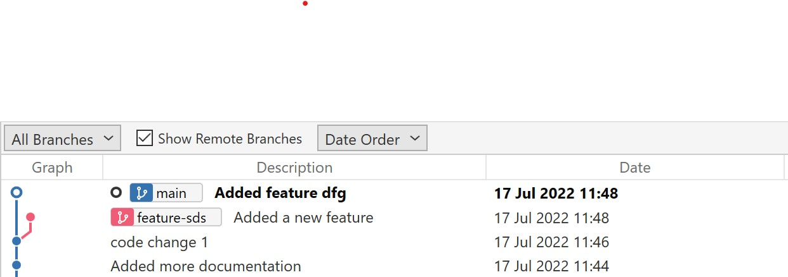
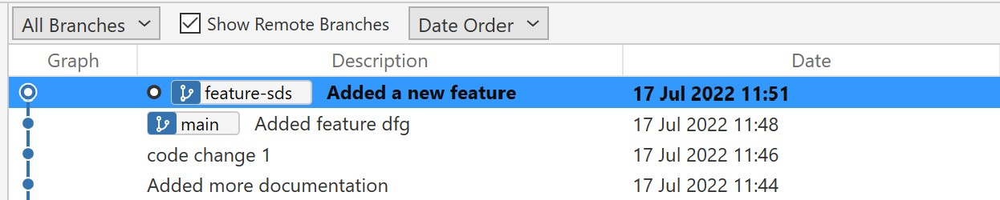

# Rebase

## Introduciton

- Branch “main” has commits “a”, “c”, “d”, …. in it (a is latest)
- Branch “feature-sds” has commits “b”, “c”, ”d”,… in it (b is latest)
- “feature-sds” was branched out of main when commit “a” was not made.
- After commit “a” is made, “feature-sds” is not based on the latest main

## Problem
- When feature-sds branch is tested, it doesn’t contain commit “a”, so there are chances the test behaves gives different result in main branch after merge
- There may be merge conflicts while merging 

## Result of Rebase

- Branch “main” has commits “a”, “c”, “d”, …. in it (a is latest)
- Branch “feature-sds” has commits “b”, “a”, “c”, ”d”,… in it (b is latest)
- Testing the feature branch is more reliable
- The probability of the merge conflict is not there after rebase
- Needed esepecially 

- Feature branches are created based on the latest commit in main
- When the feature development is in progress, there are other commits added to main by merges from other members
- This situation could cause merge conflicts and makes the testing of feature less reliable
- Rebasing soles this problem 

What is rebase (example)
- Feature branches are created based on the latest commit (say commit x) in main
- When the feature development is in progress, there are other commits added to main by merges from other members
- Lets say the latest commit on main is y
- The feature branch is based on the commit x of main branch.
- Changing the feature branch to be based on the commit y of the main branch is rebasing

How to rebase

Benefits of rebasing

