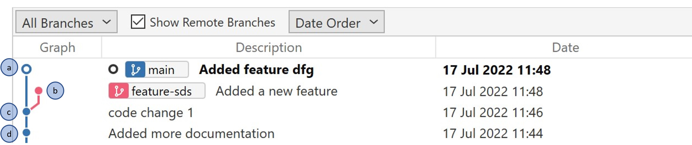

# Rebase

## Introduciton

- Branch `main` has commits `a`, `c`, `d`, …. in it (`a` is latest)
- Branch `feature-sds` has commits `b`, `c`, `d`,… in it (`b` is latest)
- `feature-sds` was branched out of main when commit “a” was not made.
- After commit `a` is made, “feature-sds” is not based on the latest main

## Problem
- When feature-sds branch is tested, it doesn’t contain commit `a`, so there are chances the test behaves gives different result in main branch after merge
- There may be merge conflicts while merging 

## Result of Rebase

- Branch `main` has commits `a`, `c`, `d`, …. in it (`a` is latest)
- Branch `feature-sds` has commits `b`, `a`, `c`, `d`,… in it (`b` is latest)

## Benefits of Rebase
- Testing the feature branch is more reliable
- The probability of the merge conflict is not there after rebase is not there

## What is rebase
- Changing the base commit of the a branch is rebasing

## Points to note
- When rebased, force push is needed
- Rebase only feature branches that are maintained by one dev, do not rebase main/develop branch

## How to rebase

### Command Prompt
- Clone the repo by the command `git clone https://github.com/GetGitReady/learn-rebase.git`
- Go to the repository by the command `cd learn-rebase`
- Check out the feature branch by the command `git checkout`
- Ensure you feature branch is checked out by the command `git branch`
- Run the command `git rebase main`

### Source Tree
- Clone the repo by the command `git clone https://github.com/GetGitReady/learn-rebase.git`
- Open the folder in Source Tree

- Ensure remote branches are shown

- Check out the branch `feature-sds`

- Ensure branch `feature-sds` is checkout out

- Right click on `main` branch label and choose `Rebase` option

### Visual Studio
- Clone the repo by the command `git clone https://github.com/GetGitReady/learn-rebase.git`
- Open the folder in visual studio

- Check out branch `feature-sds`

- Rebase on to the main

